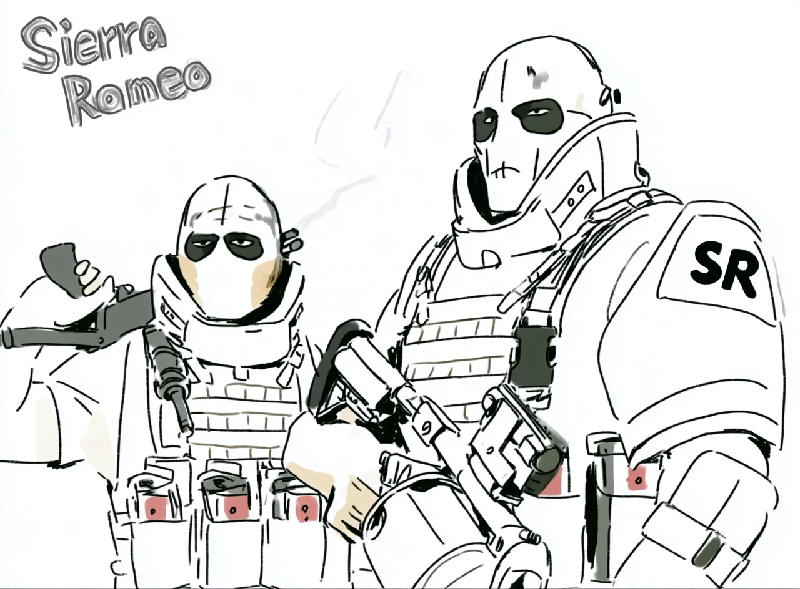
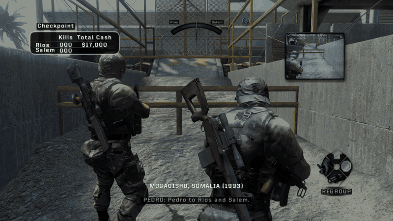
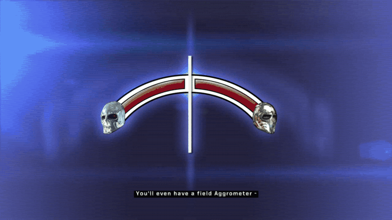
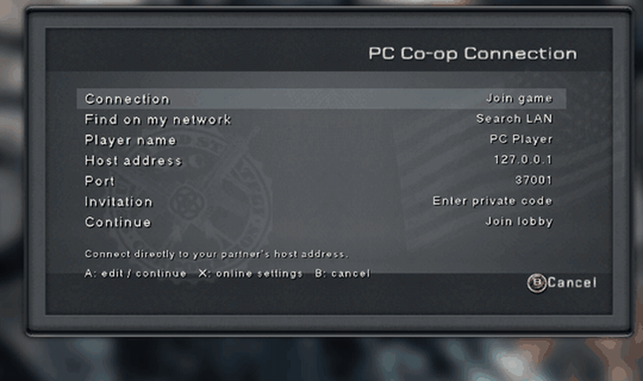

# Sierra Romeo

**Two mercenaries. A proper PC home. And, finally: more stories to tell!**

Sierra Romeo is an independent fan project bringing Army of Two's 2008 Xbox 360 release into a native Windows \[only, for now] build, with PC controls, readable interfaces, modern
connection options, & ongoing rendering repairs. Recompiled PowerPC game code
runs as native x64. Fortunately, ReXGlue supplies the platform services & GPU/audio
translation. The aim is to preserve the original campaign's personality while
making it comfortable to play, maintain, and build on today.

**0.1.0-alpha.2 preview: bring your own legally owned game.** No game download,
retail assets, generated game source, or compiled game executable is included.

## Features

This is our scope beyond getting a recompilation to boot:

* **Keyboard and mouse, alongside Xbox controllers.** Mouse look, PC bindings,
  contextual keyboard glyphs, and focus/cursor handling.

* **PC co-op connections through the real campaign menus.** Private IP/invitation
  entry, LAN discovery, a Public room browser, saved network preferences, and
  native relay support. A local directory/relay reference implementation is
  included; a hosted public service is not yet available.

* **Readability and presentation.** Retail-style prompts, subtitle backings,
  optional gameplay text contrast, a larger checkpoint results table, PC display
  settings, and a native exit confirmation.

* **Hold to skip.** A fading prompt and progress ring for supported videos:
  hold B on controller or F with keyboard prompts. In-engine cinematic coverage
  remains incomplete.

* **Rendering repairs beyond the initial ReXGlue migration.** Shared projection
  and depth corrections for reproduced decal/material failures, scene-color
  preservation for shop previews, postprocess edge corrections, and GPU queue
  and visibility-query improvements. Broader material coverage is still being
  validated; this is not a claim that every scene is fixed.

* **Local saves and useful debugging.** Automatic local storage selection,
  persistent checkpoints, and a tilde console with checkpoint travel and testing
  commands. Debug travel can change your save; use a test profile.

Sierra Romeo focuses on the above PC experience plus campaign extensions. Versus mode parity is a nice-to-have, but not a current focus of this project/extension.

## See it in action!

Campaign movement, subtitle readability, and the checkpoint results treatment:



Hold B to skip a supported video:



Private/LAN and Public co-op connection panels:



(Since these are GIFs, these are obviously reduced-frame-rate demonstrations, not performance benchmarks
or proof of cross-computer play—yet!) The checkpoint table includes a diagnostic
preview; the public browser has no service configured in this particular capture.

## What works, and what still needs proving

| Area              | Current status / next gate                                                                                                                                                                                                           |
| ----------------- | ------------------------------------------------------------------------------------------------------------------------------------------------------------------------------------------------------------------------------------ |
| Campaign          | Playable tested sections and checkpoint travel; full uninterrupted campaign completion & a reported potential loading hang still need some additional testing/coverage.                                                              |
| Performance       | Hard target: consistent **60 FPS or better with correct simulation**. Some spikes currently fluctuate \[typically] between \~50 FPS -> 60 FPS. Steady 60, hitches, and higher refresh rates remain an open item.                     |
| Co-operative Play | Original Private/Public menu flows and local two-process campaign connections exercised. Second-machine, Internet, latency and whole-campaign reliability still need add'l validation.                                               |
| UI                | PC controls and readability features implemented; font sizing, menu layout and resolution coverage need further polish, but have been started on.                                                                                    |
| Rendering         | Several reproduced failures corrected; scene/material parity and motion artifacts need wider testing, but a lot of the starter decal flickering, material errors, z-index / depth buffer issues, etc. are now in a good-to-go state. |
| Assets            | User-local originals today; optional, independently distributable enhancements are an exploration for the future but do not currently exist today.                                                                                   |
| Platforms         | Windows x64 / D3D12 exercised. Linux, macOS, other GPUs and architectures need add'l implementation & validation.                                                                                                                    |
| Distribution      | Guided GUI installer builds from your ISO dump & installs missing prerequisites for you.                                                                                                                                             |

# Get started

Use your own Xbox 360 **USA retail** dump (title `454107F8`, media `38595BF0`,
version `0.0.0.1`). Other revisions are refused. Open the release artifact
**SierraRomeo-Setup-0.1.0-alpha.2.exe**, select your ISO and installation folder,
choose your options, and select **Install**. The wizard downloads missing tools,
extracts and builds locally, then offers **Launch** and optional shortcuts.

For developers using the source ZIP with the needed build tools installed already:

```powershell
python tools/setup.py --iso "D:/My Dumps/Army of Two.iso"
# Or, after placing your complete extracted disc tree under assets/:
python tools/setup.py --use-extracted
```

The installer does not replace your saves or distribute a finished game. Back up
`userdata/player`. This is still a developer preview requiring build tools;
the GUI automates setup but signing and automatic update delivery remain planned. The main menu
shows the build version to make bug reports easier to reproduce.

## Beyond the original campaign

**2026-2027 aspiration:** explore additional fan-made, post-campaign chapters,
with the feel of DLC-sized new operations. This is a creative direction, not a
release date or a promise of completed missions. Campaign stability, faithful
rendering and reliable co-op come first. Any future content must have appropriate
rights and a distribution path separate from the original game's assets.

## Credits and contribution

Thank you to everyone credited in the original Army of Two: your craft made this
nostalgic project worth pursuing. 🙂 Thanks also to ReXGlue, Xenia and the community tools that
make this work possible!

Useful reports include build version, GPU/driver, checkpoint, controls, whether
co-op was used, and repeatable steps. Please DO NOTattach game files, extracted
assets, saves containing personal data, credentials, or game-code dumps to public
issues. Short descriptions and your own diagnostic observations are a good start.

This is an unofficial fan project, not affiliated with or endorsed by EA.
Original project code related to Sierra Romeo is licensed under [GPL-3.0-only](LICENSE). Third-party
components retain their own licenses.
